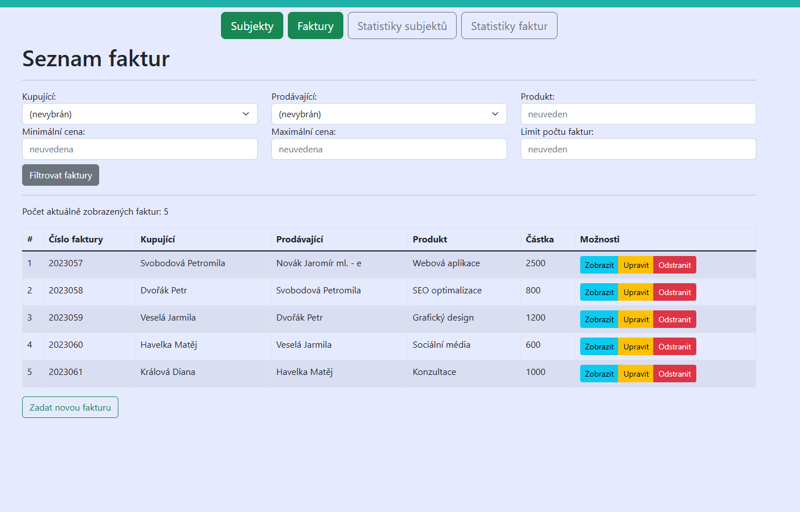
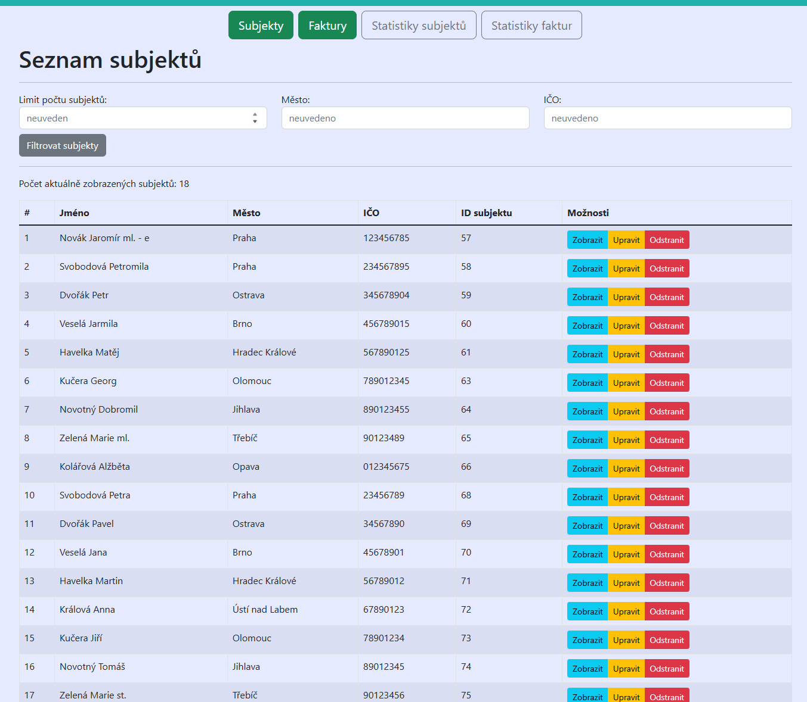
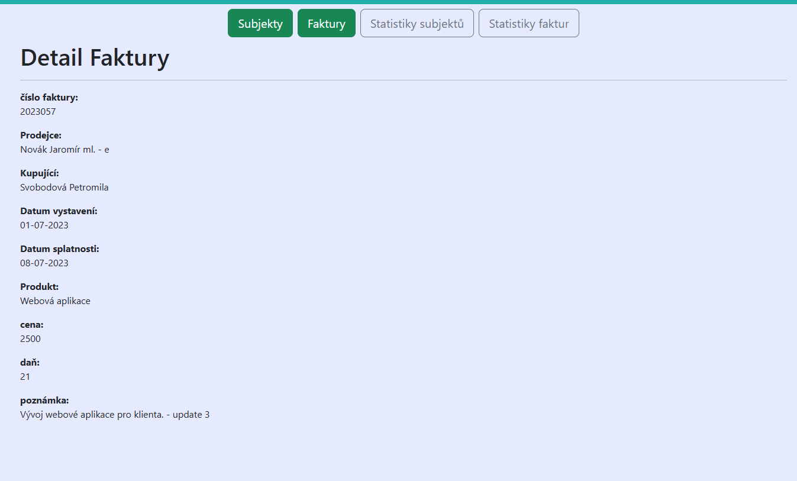
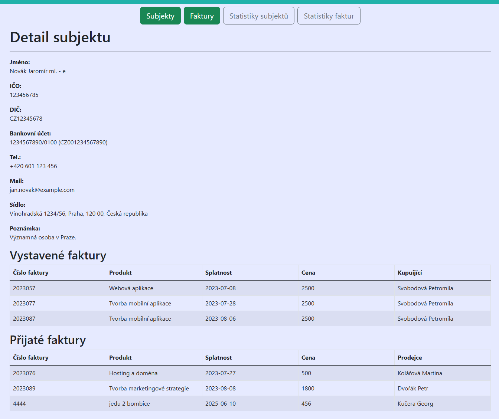

# ITNETWORK-JAVA-PRO

Tento repozitář obsahuje samostatný projekt, které byly vytvořen jako součást kurzu na [ITnetwork](https://itnetwork.cz) se specifikací Java PRO (Tvorba www aplikací). 

❗ Licence mi neumožňuje sdílet celý kód ve veřejném repozitáři. 
❗ Soubory které by porušovaly licenční podmínky ITnetwork jsou v .gitignore. 
❗ V případě **pracovní nabídky** mohu po dohodě poskytnout přístup do soukromého repozitáře. 

## 📦 Projekt je založen na:

✅ front-end: React 
✅ back-end: Spring Boot

Jedná se o základní správu subjektů (prodávající, kupující) a vystavených (přijatých) faktur. 
Projekt byl tvořen samostatně a za pomocí konzultací s vyučujícími. 
Základní kostra projektu byla poskytnuta ITnetwork. 

